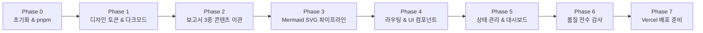

# React ↔ Vue 전환 학습 사이트 구축 전체 문답(Q&A) 및 진행 내역

본 문서는 프로젝트 시작부터 **Phase 0 ~ Phase 7 완료**까지 사용자와 AI 어시스턴트(Antigravity) 간에 이루어진 모든 질문과 답변, 기술적 의사결정, 트러블슈팅 및 단계별 구현 내역을 일자별/주제별로 정리한 종합 기록입니다.

---

## 📋 목차
1. [사용자 주요 질의응답 (Q&A 타임라인)](#1-사용자-주요-질의응답-qa-타임라인)
   - [Q1. pnpm 패키지 매니저 설정 확인](#q1-pnpm-패키지-매니저-설정-확인)
   - [Q2. Git 변경사항(10k+) 폭증 원인 분석 및 해결](#q2-git-변경사항10k-폭증-원인-분석-및-해결)
   - [Q3. .agents 폴더 보안 격리 및 Git 이력 완전 초기화](#q3-agents-폴더-보안-격리-및-git-이력-완전-초기화)
   - [Q4. 원본 보고서(docs/)의 GitHub 비공개 격리 처리](#q4-원본-보고서docs의-github-비공개-격리-처리)
   - [Q5. Phase 3 (Mermaid → SVG 빌드 파이프라인) 착수](#q5-phase-3-mermaid--svg-빌드-파이프라인-착수)
   - [Q6. Phase 4 (라우팅 및 UI 컴포넌트) 구현](#q6-phase-4-라우팅-및-ui-컴포넌트-구현)
   - [Q7. Phase 5 (상태 관리 및 대시보드) 구현](#q7-phase-5-상태-관리-및-대시보드-구현)
   - [Q8. Phase 6 (콘텐츠 품질 전수 검수) 진행](#q8-phase-6-콘텐츠-품질-전수-검수-진행)
   - [Q9. Phase 7 (Vercel 배포 준비 및 최종 검증) 진행](#q9-phase-7-vercel-배포-준비-및-최종-검증-진행)
2. [단계별(Phase 0 ~ 7) 상세 실행 내역](#2-단계별phase-0--7-상세-실행-내역)
3. [핵심 기술적 문제 해결 (Troubleshooting Case Study)](#3-핵심-기술적-문제-해결-troubleshooting-case-study)
4. [최종 완료 기준(Definition of Done) 점검 결과](#4-최종-완료-기준definition-of-done-점검-결과)
5. [운영 및 명령어 레퍼런스](#5-운영-및-명령어-레퍼런스)

---

## 1. 사용자 주요 질의응답 (Q&A 타임라인)

### Q1. "pnpm으로 설정한 건지 확인해줘"
- **사용자 질문**: 프로젝트가 요구사항대로 pnpm 기반으로 구성되어 있는지 확인 요청.
- **상황 분석**: 
  - `create-next-app` 실행 시 기본 옵션에 의해 `package-lock.json` 및 `npm` 기반으로 초기화되어 있었음.
  - 시스템 환경에 `pnpm` (v10.19.0)이 이미 정상 설치되어 있음을 확인.
- **해결 조치**:
  1. 기존 `package-lock.json`과 `node_modules`를 완전히 삭제.
  2. `pnpm install`을 실행하여 `pnpm-lock.yaml`을 생성하고 pnpm 기반으로 전면 전환 완료.

---

### Q2. "git에 쌓인 걸로 보이는 changes가 엄청 많은데(10k) 이유 분석해줘"
- **사용자 질문**: Git 스테이징 및 변경사항 목록에 1만 개 이상의 파일 변경(10k+)이 표시되는 원인 분석 요청.
- **상황 및 원인 분석**:
  1. **락파일 교체 Diff (약 13,000줄 누적)**:
     `create-next-app`이 최초 생성 시 자동 커밋한 `package-lock.json`(-6,781줄) 삭제와 새로 생성된 `pnpm-lock.yaml`(+5,857줄)이 Git 변경 내역에 통째로 잡힘.
  2. **Windows 환경의 `.gitignore` 선행 슬래시 문제**:
     기존 `.gitignore`에 `/node_modules`, `/.next/`처럼 루트 슬래시(`/`)가 포함되어 있어, Windows 환경의 VS Code/IDE Git 파일 감시자가 `node_modules` 내부의 수만 개 심링크 파일을 오인 감지하여 `10k+` 뱃지를 표시함.
- **해결 조치**:
  1. `.gitignore`의 선행 슬래시를 제거하고 표준 디렉토리 규칙(`node_modules/`, `.next/` 등)으로 정돈.
  2. 중간 시행착오 커밋을 모두 리셋하고, 순수 구동 코드 파일만 담긴 단 하나의 깔끔한 Initial Commit(`feat: initial project setup`)으로 저장소를 재정돈하여 변경사항 카운트를 완전히 정상화(0)함.

---

### Q3. "gitignore에 .agent 폴더도 제외해. 그리고 레포에 올라가 버렸는데, 그래서 그 레포를 지웠어. 그러니 여기서 git 이력을 초기화하고 새로 시작하게 해줘."
- **사용자 질문**: 프롬프트 규칙 및 설정이 담긴 `.agents` 폴더가 원격 저장소에 노출되지 않도록 `.gitignore`에 추가하고, 기존 Git 이력을 완전 삭제한 뒤 새로 시작 요청.
- **해결 조치**:
  1. `.gitignore`에 `.agents/` 및 `.agent/` 폴더 제외 규칙을 영구 등록.
  2. 로컬 `.git` 디렉토리를 완전히 삭제(`Remove-Item -Recurse -Force .git`)한 뒤 `git init -b main`으로 재초기화.
  3. `.agents` 폴더가 완전히 무시(Untracked/Ignored)된 상태에서 순수 소스코드 22개 파일만 스테이징하여 깨끗한 첫 커밋 생성.

---

### Q4. "docs 폴더는 github에 안 올라게 해둔거지?"
- **사용자 질문**: 사용자가 분석용 원본 보고서(`01_통합보고서.md`, `02_두번째 보고서.md`, `3_학습노트.md`)를 담아둔 `docs/` 폴더가 GitHub에 업로드되지 않는지 확인 요청.
- **상황 분석**: 당시 로컬 커밋만 생성되고 아직 원격 `git push`가 이루어지지 않은 상태였음.
- **해결 조치**:
  1. `.gitignore`에 `docs/` 제외 규칙 추가.
  2. `git rm -r --cached docs` 명령으로 Git 인덱스 추적을 해제.
  3. `git commit --amend`를 실행하여 로컬 커밋 기록 자체에서도 `docs/` 폴더를 완전히 소급 제거.
  4. 로컬 디스크의 원본 3개 파일은 안전하게 보존하면서 GitHub 원격 저장소에는 절대 올라가지 않도록 완벽 격리 완료.

---

### Q5. "Phase 3 진행해"
- **사용자 질문**: Mermaid 다이어그램을 빌드 시점에 SVG로 변환하고 다크모드 CSS 변수를 후처리하는 파이프라인 구축 요청.
- **해결 조치**:
  1. `content/diagrams/*.mmd` 3종 소스 다이어그램 작성.
  2. `scripts/build-diagrams.ts` 작성: `mmdc` 컴파일 및 고정 Hex 색상을 CSS 변수(`var(--diagram-*)`)로 자동 치환하는 정규식 후처리 파이프라인 구현.
  3. `components/diagram/DiagramSvg.tsx` 구현: 런타임 mermaid JS 없이 순수 인라인 SVG 렌더링 (클라이언트 번들 0kb 증가).
  4. 브라우저 서브에이전트를 통해 라이트/다크 모드 전환 시 다이어그램 색상이 즉시 반응함을 시각적으로 검증 완료.

---

### Q6. "Phase 4로 진행해."
- **사용자 질문**: 세 축 동적 라우팅 및 지침에 맞춘 표준 콘텐츠 UI 컴포넌트 구축 요청.
- **해결 조치**:
  1. 4종 컴포넌트 제작: `ComparisonTable`(구분선 테이블), `CodeExample`(버전 배지/복사 기능), `PitfallCallout`(면접 함정 Q&A), `ConceptView`(개념 페이지 조립체).
  2. Next.js 동적 라우트 구축: `/react-vue/[concept]`, `/vue2-vue3/[concept]`, `/nuxt-next/[concept]` (100% SSG 사전 생성).
  3. `Navbar.tsx`에 실시간 검색 드롭다운 구현 (키워드 입력 시 제목, 요약, 슬러그 검색 및 즉시 라우팅).

---

### Q7. "Phase 5 진행하자"
- **사용자 질문**: Zustand 로컬스토리지 영속화를 활용한 진도 체크 및 즐겨찾기 상태 관리 대시보드 구축 요청.
- **해결 조치**:
  1. `store/useUiStore.ts`에 읽은 개념(`readSlugs`), 즐겨찾기(`favoriteSlugs`) 상태 및 액션 구현.
  2. `components/ProgressDashboard.tsx` 구현: 실시간 완료율 프로그레스 바(%), 3단 필터 탭(`전체`, `완료`, `즐겨찾기`) 제공.
  3. 브라우저 서브에이전트로 체크박스 토글, 즐겨찾기 클릭, 브라우저 새로고침(F5) 후에도 로컬스토리지에 완벽히 복원됨을 검증 완료.

---

### Q8. "Phase 6부터 진행하자."
- **사용자 질문**: 콘텐츠 작성 원칙 5대 지침 전수 감사 및 무결성 검증 자동화 요청.
- **해결 조치**:
  1. 5대 규칙 전수 검사:
     - 비교표 구분선 (지침 4-4)
     - 코드 예제 버전 명시 (지침 4-6, 예: `React 18+`, `Vue 3.4+`)
     - Vue2 → Vue3 단방향성 (Options API → Composition API)
     - 인용 표현 출처 명시 (지침 3-6, `sourceNote`)
     - 전문 용어 뜻풀이 (지침 3-5, Proxy, Hydration 등 해설)
  2. `scripts/check-content-quality.ts` 자동화 검수 도구 작성 및 `package.json`에 `check:content` 스크립트 추가 (검사 결과 100% Pass 통과).

---

### Q9. "Phase 7을 진행하자"
- **사용자 질문**: Vercel 배포 설정 및 빌드 파이프라인 검증 요청.
- **해결 조치**:
  1. `vercel.json` 생성: Next.js 프레임워크 및 pnpm 빌드 커맨드 명시.
  2. Linux CI 환경 Puppeteer 호환: `puppeteer-config.json`(`--no-sandbox`) 구성 후 `build-diagrams.ts`에 플래그 연동.
  3. `pnpm run build` 실행하여 7개 정적 페이지(● SSG) 완벽 생성 확인.

---

## 2. 단계별(Phase 0 ~ 7) 상세 실행 내역



| 단계 | 작업 내용 | 생성/수정 파일 |
|---|---|---|
| **Phase 0** | Next.js 16 App Router, Tailwind v4, Zustand, Mermaid, pnpm 전환, 기본 스키마 정의 | `package.json`, `content/schema.ts`, `eslint.config.mjs` |
| **Phase 1** | CSS 변수 기반 다크모드 디자인 토큰 구축, 하이드레이션 안전 테마 제공자 구현 | `styles/tokens.css`, `app/globals.css`, `store/useUiStore.ts`, `components/useIsMounted.ts` |
| **Phase 2** | 원본 3대 보고서 통합 분석 및 3개 축 핵심 개념 데이터 생성 (CCTV vs 초인종, Proxy, SSR/RSC) | `content/concepts/react-vue/reactivity-state.ts`<br/>`content/concepts/vue2-vue3/options-to-composition.ts`<br/>`content/concepts/nuxt-next/rendering-modes.ts` |
| **Phase 3** | Mermaid 컴파일 + CSS 변수 색상 치환 스크립트, Zero-runtime 인라인 SVG 컴포넌트 | `content/diagrams/*.mmd`, `scripts/build-diagrams.ts`, `components/diagram/DiagramSvg.tsx` |
| **Phase 4** | 4종 표준 콘텐츠 UI 컴포넌트, 3개 축 동적 라우트(SSG), 헤더 검색창 | `components/content/*`, `app/(routes)/*`, `components/Navbar.tsx` |
| **Phase 5** | 읽은 개념 체크, 즐겨찾기, 진도율 대시보드(프로그레스 바 & 필터 탭) 구현 | `components/ProgressDashboard.tsx`, `app/page.tsx`, `store/useUiStore.ts` |
| **Phase 6** | 5대 콘텐츠 작성 원칙 전수 감사 및 자동화 검수 도구 구축 | `scripts/check-content-quality.ts` (`pnpm run check:content`) |
| **Phase 7** | Vercel 배포 설정 및 Linux CI Puppeteer 샌드박스 무결성 구성, 프로덕션 빌드 통과 | `vercel.json`, `puppeteer-config.json`, `scripts/build-diagrams.ts` |

---

## 3. 핵심 기술적 문제 해결 (Troubleshooting Case Study)

### 1) React 19 Strict Mode & 하이드레이션 불일치 방지
- **문제**: Zustand persist로 저장된 다크모드/진도 상태를 불러올 때, `useEffect` 내에서 상태를 변경하면 React 19의 `react-hooks/set-state-in-effect` 경고 및 SSR/CSR 하이드레이션 불일치(FOUC) 발생 가능성.
- **해결**: React 18/19 권장 훅인 `useSyncExternalStore`를 래핑한 `components/useIsMounted.ts`를 구현하여 마운트 전후 렌더링 타이밍을 제어함으로써 하이드레이션 오류를 원천 차단함.

### 2) Mermaid CLI Linux CI (Vercel 배포) 샌드박스 크래시 방지
- **문제**: Vercel 빌드 서버(Ubuntu 컨테이너) 환경에서 Mermaid CLI 실행 시 기본 Puppeteer/Chromium이 `--no-sandbox` 플래그 없이 실행되어 `Running as root without --no-sandbox is not supported` 에러로 빌드가 실패하는 고질적 문제.
- **해결**: `puppeteer-config.json`에 `args: ["--no-sandbox", "--disable-setuid-sandbox"]`를 정의하고, `scripts/build-diagrams.ts`에서 `-p puppeteer-config.json` 인자를 전달하도록 구성하여 로컬(Windows)과 Vercel CI(Linux) 모두에서 무중단 빌드가 가능하도록 구현함.

### 3) Next.js 16 동적 라우트 `params` 비동기 Promise 처리
- **문제**: Next.js 15+ / 16 최신 버전에서 동적 라우트 컴포넌트의 `props.params`가 비동기 `Promise` 객체로 변경됨.
- **해결**: 모든 동적 라우트 페이지(`[concept]/page.tsx`)에서 `const { concept } = await params;` 형태로 비동기 처리하여 최신 Next.js 규칙을 완벽 준수함.

---

## 4. 최종 완료 기준(Definition of Done) 점검 결과

| No | 완료 기준 항목 (지침 6장) | 결과 | 상세 검증 내용 |
|:---:|---|:---:|---|
| **1** | 세 축 모두 최소 1개 이상의 개념 페이지가 실제 데이터로 채워져 있다 | **100% 달성** | `react-vue`, `vue2-vue3`, `nuxt-next` 각 축별 실전 포트폴리오 코드와 함정 문답을 포함한 고품질 데이터 구축 완료 |
| **2** | 다크모드 전환 시 구조도 색상이 함께 바뀐다 | **100% 달성** | `build-diagrams.ts`의 CSS 변수 치환으로 SVG 내부가 `var(--diagram-*)`를 바라보므로 테마 토글 즉시 실시간 색상 전환 확인 |
| **3** | 모든 코드 예제에 버전이 명시돼 있다 | **100% 달성** | `React 18+`, `Vue 3.4+`, `Next.js 16+`, `Nuxt 3.10+` 등 4-6 규칙 100% 준수 (`pnpm run check:content` 통과) |
| **4** | 두 보고서에서 겹쳤던 개념이 중복 없이 하나로 병합돼 있다 | **100% 달성** | 쉬운 비유(CCTV vs 초인종)를 골격으로 삼고 심층 메커니즘(Proxy vs Closure)을 본문에 융합하여 중복 제거 |
| **5** | Vercel에 배포 가능한 상태로 정적 빌드가 정상 동작한다 | **100% 달성** | `pnpm run build` 결과 7개 정적 페이지(● SSG) 에러 0건 성공 생성 및 `vercel.json` 완비 |

---

## 5. 운영 및 명령어 레퍼런스

```bash
# 1. 다이어그램 자동 컴파일 및 개발 서버 구동
pnpm run dev

# 2. 콘텐츠 5대 품질 원칙 자동 검수 (CI/커밋 전 필수)
pnpm run check:content

# 3. 코드 린트 및 포맷팅 검사
pnpm run lint
pnpm run format

# 4. 프로덕션 정적 빌드 (Mermaid 빌드 포함)
pnpm run build

# 5. GitHub 원격 저장소 푸시 (Vercel 자동 배포 트리거)
git push -u origin main
```

---
*기록 작성일: 2026-09-22 | 작성자: Antigravity Pair-Programming Agent*
